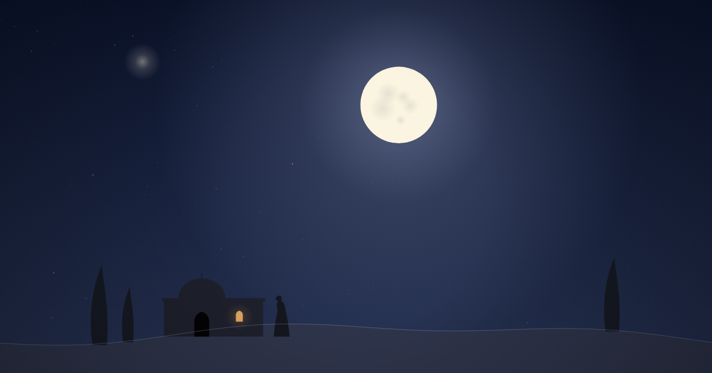

# Naqsh-e Khiyal · نقشِ خیال

**Classical Persian poems, animated couplet by couplet.**
Each poem is one self-contained web page: every couplet gets its own scene, drawn from the poem's own images, and its own music, played on a synthesized ney, santur and soft strings in a Persian dastgah.

**▶ Live site:** https://kimzify.github.io/naqsh-e-khiyal/

| Poem | Couplets | Music |
|---|---|---|
| [Hafez, Ghazal 1 · «اَلا یا اَیُّهَا السّاقی»](https://kimzify.github.io/naqsh-e-khiyal/hafez/ghazal-1/) | 7 | Shur |
| [Hafez, Ghazal 179 · «رسید مژده که ایّام غم نخواهد ماند»](https://kimzify.github.io/naqsh-e-khiyal/hafez/ghazal-179/) | 9 | Bayat-e Esfahan |
| [Hafez, Ghazal 255 · «یوسف گم‌گشته بازآید به کنعان، غم مخور»](https://kimzify.github.io/naqsh-e-khiyal/hafez/ghazal-255/) | 10 | Segah |



## Why "Naqsh-e Khiyal"?

**Naqsh (نقش)** means an image, a design, a pattern: the mark something leaves. Hafez uses it in his ghazals; in Ghazal 179, one of the poems on this site, he writes «نقشِ جور و نشانِ ستم», *the mark of cruelty and the scar of injustice*.

**Khiyal (خیال)** is the imagination, and in Persian poetry also the imagined face of the beloved that stays with the lover.

Together, **Naqsh-e Khiyal (نقشِ خیال)** is *the image that takes shape in the imagination*. That is what every page here tries to draw: the picture a couplet paints in the mind of someone who reads it.

## How it works

- **No build step, no framework, no assets to download.** Each page is a single HTML file with inline CSS and JavaScript. Scenes are drawn on a `<canvas>` as pure functions of time, so seeking, pausing and crossfading between couplets all just work.
- **The music is generated in the browser** with the Web Audio API: a Karplus–Strong santur, a breathy ney with glide and vibrato, a string pad and a drone, tuned to each poem's dastgah (quarter tones included). Each ghazal has a short musical figure that returns at the end of every couplet, like the poem's radif.
- **The text** is shown in Noto Nastaliq Urdu, both hemistichs at once, word by word, with an English gloss beneath.
- Keyboard: <kbd>Space</kbd> to pause, <kbd>←</kbd> <kbd>→</kbd> to move between couplets.
- **Visitor stats** come from [Umami](https://umami.is): anonymous and cookie-free, with no personal data stored. Besides page views, the pages count a few events: Begin, each couplet reached, the end of the poem, "Read the whole ghazal", and turning the sound off.

## Run it locally

```bash
python3 -m http.server 8000     # then open http://localhost:8000
```

Check every page for errors (this also runs on every push, in GitHub Actions):

```bash
npm install
npx playwright install chromium
npm run serve &  npm test
```

## Repository layout

```
index.html                  the gallery (home page)
hafez/ghazal-<n>/index.html one page per poem
assets/                     favicon and link-preview images
docs/ADDING-A-POEM.md       how a poem page is built, step by step
docs/DESIGN-NOTES.md        the principles the scenes follow
tests/smoke.mjs             headless check of every page
```

## Adding a poem

Read [`docs/ADDING-A-POEM.md`](docs/ADDING-A-POEM.md). In short: copy the newest page (`hafez/ghazal-255/`) as a template, write one scene function per couplet, compose the ney phrases, and add one entry to the `POEMS` list in `index.html`.

## License

Code: [MIT](LICENSE). Glosses, scene designs, music and notes: [CC BY 4.0](LICENSE-CONTENT.md). The poems of Hafez are in the public domain; texts follow [Ganjoor](https://ganjoor.net).

---

<div dir="rtl">

## نقشِ خیال، به زبان فارسی

در این پروژه غزل‌های کلاسیک فارسی بیت به بیت پویانمایی می‌شوند. هر شعر یک صفحهٔ وب مستقل است: هر بیت صحنهٔ خودش را دارد که از تصویرهای خود شعر گرفته شده، و موسیقی خودش را که با نی و سنتور و زهیِ نرمِ ساخته‌شده در مرورگر، در یکی از دستگاه‌های موسیقی ایرانی نواخته می‌شود.

- هر دو مصراع با هم و کلمه به کلمه با خط نستعلیق نشان داده می‌شوند و ترجمهٔ انگلیسی زیرشان می‌آید.
- هر غزل یک جملهٔ کوتاه موسیقایی دارد که آخر هر بیت تکرار می‌شود، مثل ردیف شعر.
- هیچ فایل صوتی یا تصویری دانلود نمی‌شود؛ همه‌چیز در لحظه در مرورگر ساخته می‌شود.
- آمار بازدید با [Umami](https://umami.is) گرفته می‌شود: ناشناس و بدون کوکی، و هیچ اطلاعات شخصی‌ای ذخیره نمی‌شود.

### چرا «نقش خیال»؟

**نقش** یعنی تصویر، طرح و نگاره؛ اثری که چیزی از خود به جا می‌گذارد. حافظ هم آن را در غزل‌هایش به کار برده؛ در غزل ۱۷۹، که یکی از شعرهای همین سایت است، می‌گوید: «که نقشِ جور و نشانِ ستم نخواهد ماند».

**خیال** یعنی تخیل، و در شعر فارسی تصویرِ معشوق که در ذهن عاشق می‌ماند.

**نقشِ خیال** یعنی تصویری که در خیال نقش می‌بندد. هر صفحهٔ این سایت می‌خواهد همین را بکشد: تصویری که یک بیت در ذهنِ خواننده می‌سازد.

متن اشعار از [گنجور](https://ganjoor.net) است. کد با مجوز MIT و ترجمه‌ها، طرح صحنه‌ها و موسیقی با مجوز CC BY 4.0 منتشر شده‌اند.

</div>
